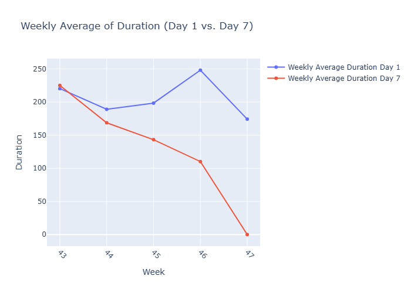
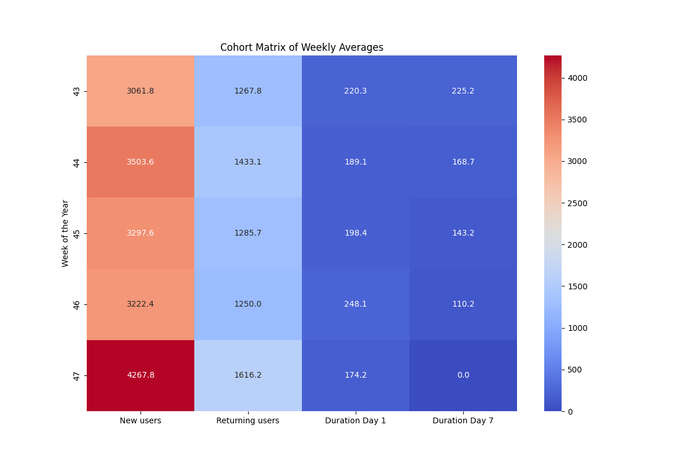

# Cohort Analysis & User Engagement Trends

This project analyzes user engagement patterns over time from `cohorts.csv`.  
It visualizes trends in **New Users**, **Returning Users**, and **User Durations (Day 1 & Day 7)**,  
and summarizes insights with **weekly averages** and a **cohort matrix**.

##  Project Structure

├── cohorts.csv # Input dataset containing user activity data
├── main.py # Analysis & visualization script
├── Cohort_trends/ # Output folder for generated plots
│ ├── user_trend.png
│ ├── duration_trend.png
│ ├── correlation_matrix.png
│ ├── weekly_user_trend.png
│ ├── weekly_duration_trend.png
│ └── cohort_matrix_weekly_averages.png

##  Dataset

The `cohorts.csv` file should have the following columns:

| Column Name         | Type        | Description |
|--------------------|-------------|-------------|
| Date               | date/string | Date of the measurement (converted to datetime) |
| New users          | int         | Number of new users on that date |
| Returning users    | int         | Number of returning users |
| Duration Day 1     | float       | Avg. engagement duration for Day 1 users |
| Duration Day 7     | float       | Avg. engagement duration for Day 7 users |

##  How It Works

1. **Data Preprocessing**
   - Reads `cohorts.csv`
   - Converts `Date` column to datetime format
   - Handles any parsing errors

2. **Visualizations Generated**
   - `user_trend.png` — Trend of new and returning users over time
   - `duration_trend.png` — Average duration (Day 1 & Day 7) over time
   - `correlation_matrix.png` — Correlation heatmap of all numeric columns
   - `weekly_user_trend.png` — Weekly averages of new vs. returning users
   - `weekly_duration_trend.png` — Weekly averages of durations (Day 1 vs. Day 7)
   - `cohort_matrix_weekly_averages.png` — Weekly averages as a cohort matrix

3. **Weekly Aggregation**
   - Groups data by ISO week number
   - Computes averages for all metrics

4. **Cohort Matrix**
   - Displays weekly averages in a heatmap for quick comparison

##  Running the Script

# Install dependencies
pip install pandas plotly seaborn matplotlib

# Run the analysis
python main.py

# Insights Example
    User Trends: Both new and returning users fluctuate week to week,
    with noticeable spikes (e.g., Week 47 saw significant growth).

    Duration Trends: Day 1 and Day 7 engagement durations vary independently
    from user counts, suggesting other factors may influence engagement.

    Correlations: Useful for spotting relationships between user growth
    and engagement durations.

#  Sample Outputs
#  User Trend Over Time

    

# Weekly Duration Trends

    

# Cohort Matrix of Weekly Averages
        
    

#  Notes
    Ensure that the Date column in cohorts.csv is properly formatted (YYYY-MM-DD).
    Missing values in the dataset will be handled as NaN.
    The script saves all output plots automatically — no need to open them interactively
